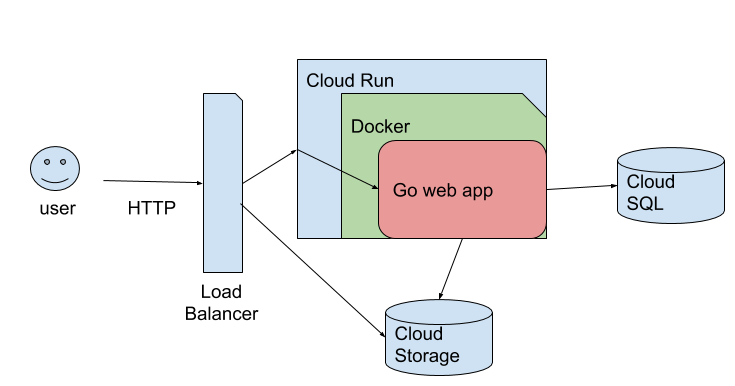
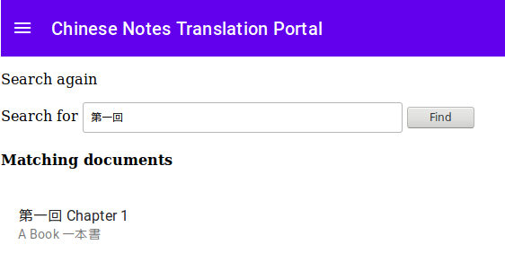
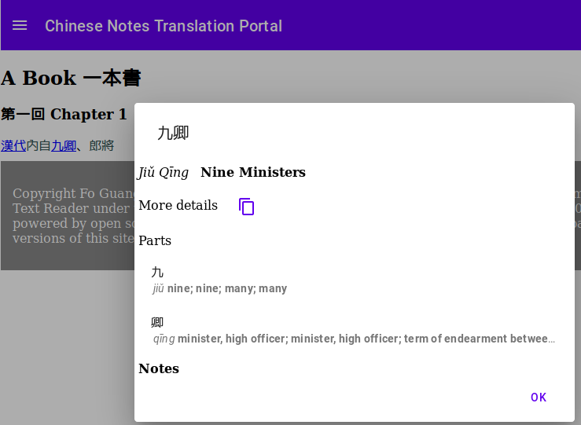

# Chinese Notes Dictionary App and Translation Portal

A Go web application and text processing library for translation from Chinese to
English that is adaptable to different dictionaries and corpora, powering
these use cases

1. A web site for Chinese-English dictionary lookup and language tools for
   language learning and reference
2. A password protected translation portal for a team of translators
3. A software library for Chinese text processing

Features include:

1. Chinese-English dictionary word lookup
2. Chinese text tokenization
3. Translation memory (optional)
4. Full text search of a Chinese corpus (optional)
5. Password proection (optional)
6. Integration with a rich JavaScript web client (optional)
7. Integration with a backend SQL databsae (optional)
8. Go module with Go and JSON APIs for interactive Chinese text processing
   - as opposed to batch processing of a corpus for indexing

A screenshot of dictionary lookup of multiple terms with text tokenization is
shown below.


The web app drives the https://chinesenotes.com, https://ntireader.org, and
https://hbreader.org web site and a private translation portal
developed for Fo Guang Shan, working together with the 
[Fo Guang Shan Institute of Humanistic Buddhism](http://fgsihb.org/) and
[Nan Tien Institute](https://www.nantien.edu.au/).

The items above marked as optional require some special set-up, as described
below.

## Setup

Install [Go](https://golang.org/doc/install).

## Quickstart

In a terminal, run the commands to get the command line app and download the
dicitonary

```shell
PATH=$PATH:$HOME/go/bin
go install github.com/alexamies/cnreader@latest
cnreader -download_dict
```

Set an environment variable to let the app know where its home is

```shell
export CNWEB_HOME=.
```

Install the app

```shell
go install github.com/alexamies/chinesenotes-go@latest
```

Run the app

```shell
chinesenotes-go
```

When you see the output 

```
...
Starting http server at http://localhost:8080
```

navigate to http://localhost:8080 with your browser. Enter some Chinese words
and see the English equivalents. With no environment settings the dictionary
will be loaded from the Net.

## Basic Usage

The repo contains a number of file that allow for customization of the app. To
get them, clone this repo:

```shell
git clone https://github.com/alexamies/chinesenotes-go.git
```

Then cd into the directory cloned:

```shell
cd chinesenotes-go
```

Build the app

```shell
go build
```

Run the web server

```shell
./chinesenotes-go
```

Navigate to http://localhost:8080

You can change styles by changing the CSS settings in the file `web/styles.css`.
The webconfig.yaml file and HTML tempates in /templates allow some additional
customization. The HTML interface is very basic, just enough for minimal
testing. See the [web-resources](web-resources/README.md) directory for
customization of template files. Make sure that the `TemplateDir` parameter is
set in the `webconfig.yaml` file for this to take effect.
Another approach is to use AJAX communicate with the web app with complete
customization of the web user interface, as in
https://github.com/alexamies/chinesenotes.com .

### Development testing

In another terminal

```shell
curl http://localhost:8080/find/?query=邃古
```

You should see JSON encoded data sent back.

## Features

### Chinese-English dictionary word lookup

The data/testdict.tsv file gives an example file that illustrates the
structure of the dictionary. The dictionary is indexed by both simplified and
traditional Chinese. Lookup by Chinese word is supported in file mode. 
You will need to install and setup the database to do lookup by English word
Hanyu pinyin. 

### Chinese text tokenization

Given a string of Chinese text, the web app will segment it into words or
multiword expressions contained in the dictionary. This saves a lot of time
for readers who look up many words or discover how the words in a phrase are
grouped, since there are no spaces in Chinese sentences. The presence of the
dictionary files is needed for this. They can be loaded either from the file
system or from the database by the web app.

### Digital Library

The web app can support a library of Chinese texts. The texts in the library
will be scanned with the Chinese terms enabled for mouse-over and clicking to
find the English equivalents. The titles of the documents are also indexed to
enable title search. This requires setting up the library files and list of
texts with a certain structure, which is explained below.

### Translation memory

Translation memory search find the closest matching term based on multiple
criteria, including how many characters match, similarity of the character
order, Pinyin match, and inclusion of the query in the notes. This depends on
compilation of the translation memory index and loading it into the database.

### Full text search of the Digital Library

Full text search of a Chinese corpus allows users to search a monolingual
Chinese corpus. First, you need 

1. Have a corpus following the layout conventions
of Chinese Notes.
2. Compile the index, which computes word and bigram frequencies for each
   document with the cnreader command
3. Load the index files into the database
4. Load the corpus files into Google Cloud Storage

For the corpus structure see
https://github.com/alexamies/chinesenotes.com/tree/master/data/corpus

### Integration with a rich JavaScript web client (optional)

For web resources to give a higher quality user experience than the basic Go
HTML templates using Material Design Web, see
(Material Design Web Resources)[web_resources/README.md].

For an implementation where the communication with the backend uses AJAX, see
the web files at 

https://github.com/alexamies/chinesenotes.com/tree/master/web-resources

## FAQ

Q: Why would I use a dictionary and translation memory to translate Chinese
text instead of machine translation?

A: This project is based around the idea of using linguistic assets, including
a dictionary, named entity database, and translation memory, to aid in
translation. To translate literature, especially classical literature and
Buddhist texts, and to prepare for publishing you will need to thoroughly
understand what you are the source Chinese text.

Q: Can I use the Chinese Notes Translation Portal software for my own project?

A: Yes, please do that. It is also adaptable to your own dictionary, glossary,
and corpus of source text.

## Architecture

This project is designed to be easy to setup with minimal dependencies but
also run in a production architecture like shown below.



Various flavors are possible depending on how it is configured. It can
interoperate with the other components in the Chinese Notes family

1. [cnreader](https://github.com/alexamies/cnreader) - Command line utility
   for generating indexes and HTML files for the reader
2. [chinesedict-js](https://github.com/alexamies/chinesedict-js) - JavaScript
   package for browser module for the dictionary and text parser
3. [chinesenotes-python](https://github.com/alexamies/chinesenotes-python) -
   Pyhton utilities for Chinese text analysis
4. [chinesenotes.com](https://github.com/alexamies/chinesenotes.com) -
   Chinese-English dictionary and corpus of historic Chinese literature
5. [buddhist-dictionary](https://github.com/alexamies/buddhist-dictionary) -
   Buddhist dictionary extensions to the Chinese-English dictionary and
   structure to present the Taisho Tripitaka as a digital library for
   ntireader.org

## Digital Library Setup

The setup of the library requires the structure explained in
<a href='https://github.com/alexamies/cnreader'
>https://github.com/alexamies/cnreader</a>. There is a small set of sample
files also included in this project to facilitate getting started and testing.
Set the environment variable `CNWEB_HOME` to the location of the library and
export it. It does not have to be the home directory of the chinesenotes-go
project but it can be to get started.

```shell
export CNWEB_HOME=.
```

To generate the static HTML files for the library and to enable mouseover and
clicking of Chinese terms to find English equivalents, run the command

```shell
go run github.com/alexamies/cnreader
```

This generates the HTML files in the `web` directory.

To index the titles run

```shell
go run github.com/alexamies/cnreader -titleindex
```

This generates the file `documents.tsv`, which is used for title search. It
is a flat structure transformed from their hierarchical, human-edited structure
with the Chinese and English parts of the titles separated.

After running the commands above, restart the application

```shell
go run github.com/alexamies/chinesenotes-go
```

Go to the Library menu and search on a document title. You should see something
like shown in the screenshot below.



You should be able to click on the title to follow a link to the document.

## Database Setup

The prepared statements in the Go code assuming a MySQL driver. Maria
is compatible with MySQL. The local development instructions assume a Mariadb
database running in Docker. For full details about the database see the
[Mariadb Documentation](https://mariadb.org/).

Install Docker if you have not already.

### Translation memory files

The command to download the dictionary files was given above. Generate the
translation memory index files with the command

```shell
go run github.com/alexamies/cnreader -tmindex
```

The index files are saved in the `index` directory.

### Mariadb Docker Image

See the documentation at [Mariadb Image 
Documentation](https://hub.docker.com/_/mariadb/) and [Installing and using 
MariaDB via Docker](https://mariadb.com/kb/en/library/installing-and-using-mariadb-via-docker/).

To start a Docker container with Mariadb and connect to it from a MySQL command
line client execute the command below. First, set environment variable 
`MYSQL_ROOT_PASSWORD`. Also, create a directory outside the container to use as a
permanent Docker volume for the database files. In addition, mount volumes for
the tabe separated data to be loaded into Mariadb. See 
[Manage data in Docker](https://docs.docker.com/storage/) and 
[Use volumes](https://docs.docker.com/storage/volumes/) for details on volume
and mount management with Docker. In another terminal, create a Maria DB
database with the commands

```shell
cd ..
mkdir mariadb
cd mariadb
MYSQL_ROOT_PASSWORD=[your password]
CNREADER_HOME=../chinesenotes-go
mkdir mariadb-data
docker run --name mariadb -p 3306:3306 \
  -e MYSQL_ROOT_PASSWORD=$MYSQL_ROOT_PASSWORD -d \
  -v "$(pwd)"/mariadb-data:/var/lib/mysql \
  --mount type=bind,source="$CNREADER_HOME"/data,target=/cndata \
  --mount type=bind,source="$CNREADER_HOME"/index,target=/cnindex \
  mariadb:10
```

The data in the database is persistent even if the container is deleted. To
restart the database use the command

```shell
docker restart  mariadb
```

To load data from other sources connect to the database container
or start up a mysql-client

```shell
docker exec -it mariadb bash
```

In the container command line

```shell
mysql --local-infile=1 -h localhost -u root -p
```

### Load dictionary data into the database

The first time you run this execute the commands in `data/first_time_setup.sql`.

Create the table definitions

```sql
source cndata/chinesenotes.ddl
```

are in the index
directory.

Load the data into the database

```sql
use cnotest_test;
LOAD DATA LOCAL INFILE 'cndata/grammar.txt' INTO TABLE grammar CHARACTER SET utf8mb4 LINES TERMINATED BY '\n';
LOAD DATA LOCAL INFILE 'cndata/topics.txt' INTO TABLE topics CHARACTER SET utf8mb4 LINES TERMINATED BY '\n';
LOAD DATA LOCAL INFILE 'cndata/words.txt' INTO TABLE words CHARACTER SET utf8mb4 LINES TERMINATED BY '\n' IGNORE 1 LINES;
LOAD DATA LOCAL INFILE 'cnindex/tmindex_uni_domain.tsv' INTO TABLE tmindex_uni_domain CHARACTER SET utf8mb4 LINES TERMINATED BY '\n';
LOAD DATA LOCAL INFILE 'cnindex/tmindex_unigram.tsv' INTO TABLE tmindex_unigram CHARACTER SET utf8mb4 LINES TERMINATED BY '\n';
```

Quit from the Maria DB client session

```sql
quit
```

### Run against a databsae

Restart the web application server.

```shell
export DBUSER=app_user
export DBPASSWORD="[your password]"
export DATABASE=cnotest_test
export DBHOST=localhost
./chinesenotes-go
```

From the command line in a new shell you should be able to do a query like

```shell
curl http://localhost:8080/find/?query=antiquity
```

You should see JSON returned.

### Updating the dictionary

If you add more words to the dictionary, you can update it with the SQ commands:

```sql
use cnotest_test;
DELETE FROM words;
```

Restart the web application.

### JavaScript Integration

The `web-resources` directory has sufficient JavaScript for the meu system
and display of vocabulary dialog in HTML pages. Building the JavaScript bundle
requires installation of Node.js. The bundle is compiled from TypeScript.

To build it

```shell
cd web-resources
npm install
npm run-script build
cp dist/cnotes-compiled.* ../web/
cd ..
```

The JavaScript code depends on a JSON bundle of the dictionary. This requies
Python 3 to build. It can be created and saved to the right location with the
command

```shell
python3 bin/words2json.py "data/words.txt" web/words.json
```

Try starting the app, navigating to the library and clicking on a term. The
JavaScript enables a popover dialog like shown below.




## Deploy to Cloud Run with a Cloud SQL databsae

The steps here describe how to deploy and run on Google Cloud with Cloud Run,
Cloud SQL, and Cloud Storage. This assumes that you have a Google Cloud project. 

### Set up a Cloud SQL Database
New: Replacing management of the Mariadb database in a Kubernetes cluster
Follow instructions in 
[Cloud SQL Quickstart](https://cloud.google.com/sql/docs/mysql/quickstart)
using the Cloud Console.

Create a Cloud SQL instance with the Cloud Console user interface. Then log into
it in the Cloud Shell with the command

```shell
INSTANCE=[your instance]
gcloud sql connect $INSTANCE --user=root
```

In the MySQL client create a database and add an app user with the commands in
data/firt_time_setup.sql. Create the tables with the commands in
chinesenotes.ddl, and add test data as needed. You can clone this Git project
to get the same data files.

### Cloud Storage
If you are using full text search, create a GCS bucket and copy your corpus
files to it. You the environment variable TEXT_BUCKET inform the web app of
the bucket name.

```shell
TEXT_BUCKET=[Your GCS bucket name]
gsutil mb gs://$TEXT_BUCKET
gsutil -m rsync -d -r corpus gs://$TEXT_BUCKET
```

### Cloud Run

Use
[Cloud Build](https://cloud.google.com/cloud-build)
to build the Docker image and upload it to the Google Container Registry:

```shell
export PROJECT_ID=[Your project]
BUILD_ID=[your build id]
nohup gcloud builds submit --config cloudbuild.yaml . \
  --substitutions=_IMAGE_TAG="$BUILD_ID" &
```

Then deploy to Cloud Run with the command

```shell
IMAGE=gcr.io/${PROJECT_ID}/cn-portal-image:${BUILD_ID}
SERVICE=cn-portal
REGION=us-central1
INSTANCE_CONNECTION_NAME=[Your connection]
DBUSER=[Your database user]
DBPASSWORD=[Your database password]
DATABASE=[Your database name]
MEMORY=400Mi
TEXT_BUCKET=[Your GCS bucket name for text files]
CNWEB_HOME=.
gcloud run deploy --platform=managed $SERVICE \
--image $IMAGE \
--region=$REGION \
--memory="$MEMORY" \
--add-cloudsql-instances $INSTANCE_CONNECTION_NAME \
--set-env-vars INSTANCE_CONNECTION_NAME="$INSTANCE_CONNECTION_NAME" \
--set-env-vars DBUSER="$DBUSER" \
--set-env-vars DBPASSWORD="$DBPASSWORD" \
--set-env-vars DATABASE="$DATABASE" \
--set-env-vars TEXT_BUCKET="$TEXT_BUCKET" \
--set-env-vars CNREADER_HOME="/"
```

If the traffic is not migrated to the latest version run the command

```shell
gcloud run services update-traffic --platform=managed $SERVICE \
  --region=$REGION \
  --to-revisions=LATEST=100
```

### Custom Domain and SSL

These instructions described how to setup a custom domain and SSL on Google
Cloud with a Google Cloud Load Balancer and Cloud Run as a backend Network
Endpoint Group (NEG). It is assumed that you already have the app deployed on
Cloud Run using the instructions above.

#### Configuring the load balancer

Create a serverless NEG for the Cloud Run deployment

```shell
NEG=[name of NEG]
gcloud compute network-endpoint-groups create $NEG \
    --region=$REGION \
    --network-endpoint-type=serverless \
    --cloud-run-service=$SERVICE
```

Create a load balancer backend service

```shell
LB_SERVICE=[name of service]
gcloud compute backend-services create $LB_SERVICE --global
```

Add the NEG to the backend service

```shell
gcloud beta compute backend-services add-backend $LB_SERVICE \
    --global \
    --network-endpoint-group=$NEG \
    --network-endpoint-group-region=$REGION
```

Create a URL map as below, except if you are setting up a private portal with
login required, see the instructions under password protecting the site below.

```shell
URL_MAP=[your url map name]
gcloud compute url-maps create $URL_MAP \
    --default-backend-bucket $BACKEND_BUCKET
```

Create a matcher for backend bucket holding cacheable content

```shell
BACKEND_CBUCKET=[your matcher name]
CBUCKET=[your bucket name]
gcloud compute backend-buckets create $BACKEND_CBUCKET \
    --gcs-bucket-name=$CBUCKET \
    --enable-cdn \
    --cache-mode=CACHE_ALL_STATIC
```

Create a matcher for the NEG backend service

```shell
MATCHER_NAME=[your matcher name]
gcloud compute url-maps add-path-matcher $URL_MAP \
    --default-backend-bucket $BACKEND_BUCKET \
    --path-matcher-name $MATCHER_NAME \
    --path-rules="/find/*=$LB_SERVICE,/findadvanced/*=$LB_SERVICE,/findmedia/*=$LB_SERVICE,/findsubstring=$LB_SERVICE,/findtm=$LB_SERVICE,/cached/*=$BACKEND_CBUCKET"
```

Enable compression for cached content:

```shell
gcloud beta compute backend-buckets update $BACKEND_CBUCKET \
    --compression-mode=AUTOMATIC
```

Configure the target proxy

```shell
TARGET_PROXY=[your target proxy name]
gcloud compute target-http-proxies create $TARGET_PROXY \
    --url-map $URL_MAP

STATIC_IP=[your static ip]
gcloud compute addresses create $STATIC_IP --global

FORWARDING_RULE=[your forwarding rule name]
gcloud compute forwarding-rules create $FORWARDING_RULE \
    --address $STATIC_IP \
    --global \
    --target-http-proxy $TARGET_PROXY \
    --ports 80
```

Check the name of the forwarding-rule and url-map
```
gcloud compute forwarding-rules list
gcloud compute url-maps list
gcloud compute url-maps describe $URL_MAP
```

At this point you should be able to access the site via the static IP.

```shell
IP=[output from command above]
curl http://${IP}
```

To update the load balancer

```shell
gcloud compute url-maps edit $URL_MAP
```

#### Custom domain

Register your domain name. Create an A record pointing to the static IP created
above. It may take time for the DNS record to propagate.

At this point you should be able to access the site via the custom domain.

```shell
SITEDOMAIN=[output from command above]
curl http://${SITEDOMAIN}
```


#### HTTPS Setup

Create an SSL cert

```shell
SSL_CERTIFICATE_NAME=[your cert name]
gcloud compute ssl-certificates create $SSL_CERTIFICATE_NAME \
  --domains=$SITEDOMAIN \
  --global
```

It may take some time to provision the cert.

Create a target proxy

```shell
SSL_TARGET_PROXY=[your proxy]
gcloud compute target-https-proxies create $SSL_TARGET_PROXY \
    --url-map=$URL_MAP \
    --ssl-certificates=$SSL_CERTIFICATE_NAME
```

Create a forwarding rule

```shell
SSL_FORWARDING_RULE=[your forwarding rule]
gcloud compute forwarding-rules create $SSL_FORWARDING_RULE \
    --address $STATIC_IP \
    --ports=443 \
    --global \
    --target-https-proxy $SSL_TARGET_PROXY
```

It may take a few minutes to update the load balancer.

At this point you should be able to access the site via the custom domain with
HTTPS.

```shell
curl https://${SITEDOMAIN}
```


## Password protecting the web app

To set up the translation portal with password protection, a database and
HTTPS are required. Cryptographically hashed passwords are stored in the
database. Cookies are used to maintain a session.

First configure the database:

```shell
docker exec -it mariadb bash
```

In the container command line

```shell
mysql --local-infile=1 -h localhost -u root -p
```

In the mysql client give the app runtime permission to update and add an admin
user

```sql
USE mysql;
GRANT SELECT, INSERT, UPDATE ON cnotest_test.* TO 'app_user'@'%';

use cnotest_test;

INSERT INTO 
  user (UserID, UserName, Email, FullName, Role, PasswordNeedsReset, Organization, Position, Location) 
VALUES (1, 'admin', "admin@email.com", "Privileged User", "admin", 0, "Test", "Developer", "Home");

INSERT INTO passwd (UserID, Password) 
VALUES (1, '[your hashed password]');
```

Note that the password needs to be SHA-256 hashed before inserting. If the user
forgets their password, there is a password recovery function, which requires
setup of a [SendGrid](https://sendgrid.com) account and generation of an
API, which is stored in the env variable SENDGRID_API_KEY.

Set the environment variable PROTECTED, the SITEDOMAIN variable for cookies:

```shell
export PROTECTED=true
export SITEDOMAIN=localhost
./chinesenotes-go
```

Note that you need to have HTTPS enabled for cookies to be sent with most
browsers. You can create a self-signed certificate, run locally without one,
or deploy to a managed service like [Cloud Run](https://cloud.google.com/run).

For deployment to Cloud Run use the command

```shell
PROTECTED=true
SITEDOMAIN=[your domain]
IMAGE=gcr.io/${PROJECT_ID}/cn-portal-image:${BUILD_ID}
SERVICE=cn-portal
REGION=us-central1
INSTANCE_CONNECTION_NAME=[Your connection]
DBUSER=[Your database user]
DBPASSWORD=[Your database password]
DATABASE=[Your database name]
MEMORY=400Mi
TEXT_BUCKET=[Your GCS bucket name for text files]
CNWEB_HOME=.
SENDGRID_API_KEY=[Your API key]
gcloud run deploy --platform=managed $SERVICE \
--image $IMAGE \
--region=$REGION \
--memory="$MEMORY" \
--allow-unauthenticated \
--add-cloudsql-instances $INSTANCE_CONNECTION_NAME \
--set-env-vars INSTANCE_CONNECTION_NAME="$INSTANCE_CONNECTION_NAME" \
--set-env-vars DBUSER="$DBUSER" \
--set-env-vars DBPASSWORD="$DBPASSWORD" \
--set-env-vars DATABASE="$DATABASE" \
--set-env-vars TEXT_BUCKET="$TEXT_BUCKET" \
--set-env-vars CNWEB_HOME="/" \
--set-env-vars CNREADER_HOME="/" \
--set-env-vars PROTECTED="$PROTECTED" \
--set-env-vars SITEDOMAIN="$SITEDOMAIN" \
--set-env-vars SENDGRID_API_KEY="$SENDGRID_API_KEY"\
--set-env-vars PROJECT_ID="$PROJECT_ID" \
--set-env-vars DEEPL_AUTH_KEY="$DEEPL_AUTH_KEY" \
--set-env-vars TRANSLATION_GLOSSARY="$TRANSLATION_GLOSSARY"
```

You will need to add the users manually using SQL statements. There is no
user interface to add users yet.

For additional customization you can change the title of the portal with the
`Title` variable in the webconfig.yaml file, edit the `styles.css` sheet, or
edit the templates under the /templates directory.
For the even more customization, just use the portal server JSON API to driver
a JavaScript client.

For a custom domain, follow the instructions above, except there is no backend
bucket. Instead all the static content is included in the container. So when
seting up the load balancer, create the URL map as

```shell
gcloud compute url-maps create $URL_MAP \
  --default-service $LB_SERVICE
```

Create a matcher for the NEG backend service with the command below

```shell
MATCHER_NAME=[your matcher name]
gcloud compute url-maps add-path-matcher $URL_MAP \
    --default-service $LB_SERVICE \
    --path-matcher-name $MATCHER_NAME \
    --path-rules="/find/*=$LB_SERVICE,/findadvanced/*=$LB_SERVICE,/findmedia/*=$LB_SERVICE,/findsubstring=$LB_SERVICE,/findtm=$LB_SERVICE"
```

## Corpus content and full text search

Full text search requires an forward and reverse indexes: The forward index
is like a table of contents describing the titles and files of the text
documents. There is a three level structure:

```
corpus
-- collection
  -- document
```

This gives a way of organizing a corpus of documents in a book library like
structure with, say, one book per collection, one chapter per document. The
structure also provides a way to construct links for users to navigate search
results.

The reverse index is based on unigrams and bigrams with a BM25 formula to give
the most relevant documents for a given text search.
To generate the reverse index install the `cnreader` command
line tool
https://github.com/alexamies/chinesenotes.com/tree/master/go/src/cnreader

Run the command with no flags

```shell
mkdir -p web/example_collection/
mkdir -p web/analysis/example_collection
export CNREADER_HOME=.
go run github.com/alexamies/cnreader
```

This will write the full text index files into the `index` directory and
marked up HTML files in the `example_collection` directory. Add a link in the
`library.html` template to the page `/web/texts.html`. After starting the web
server again you should be able to navigate to the list of texts and see
Chinese words marked up with English equivalents on mouseover. You can change
the config.yaml `VocabFormat` variable to create other markup options, including
hyperlinks to dictionary pages and dialog boxes.

For full text search, you will need to load the document indexes into the 
database. There are sample forward index files in the `data/corpus` directory
which can be used for testing. Load them all into the databsae with the SQL
commands

```sql
use [your database];
LOAD DATA LOCAL INFILE 'cndata/corpus/collections.csv' INTO TABLE collection CHARACTER SET utf8mb4 LINES TERMINATED BY '\n' IGNORE 1 LINES;
LOAD DATA LOCAL INFILE 'cndata/corpus/example_collection.tsv' INTO TABLE document CHARACTER SET utf8mb4 LINES TERMINATED BY '\n'  IGNORE 1 LINES;;
LOAD DATA LOCAL INFILE 'cnindex/word_freq_doc.txt' INTO TABLE word_freq_doc CHARACTER SET utf8mb4 LINES TERMINATED BY '\n';
LOAD DATA LOCAL INFILE 'cnindex/bigram_freq_doc.txt' INTO TABLE bigram_freq_doc CHARACTER SET utf8mb4 LINES TERMINATED BY '\n';
```

If the site is password protected then copy the generated HTML files to the
`translation_portal` directory. If the site is open then copy the HTML files
to GCS with a load balancer in front, as per the instructions at
https://github.com/alexamies/chinesenotes.com

Copy the plain text files to the GCS text directory with environment variable
`TEXT_BUCKET`.

Start up the web app again and view the pages:

```shell
./chinesenotes-go
```

Copy the text files to an object store. The only one currently supported is
Google Cloud Storage (GCS):

```
TEXT_BUCKET={your txt bucket}
# First time
gsutil mb gs://$TEXT_BUCKET
gsutil -m rsync -d -r corpus gs://$TEXT_BUCKET
```

If you are using Cloud Run then the application automatically has access to GCS.
To enable the web application to access the storage system for other platforms,
create a service account with a GCS Storage Object Admin role and download the
JSON credentials file, as described in 
[Create service account credentials](https://cloud.google.com/kubernetes-engine/docs/tutorials/authenticating-to-cloud-platform).
Assuming that you saved the file in the current working directory as 
credentials.json, create a local environment variable for local testing

```
export GOOGLE_APPLICATION_CREDENTIALS=$PWD/credentials.json
```

## Containerize the app and run locally against a databsae

If you are not using Google Cloud, you can follow these instructions to
build the Docker image for the Go application and run locally:

```shell
sudo docker build -t cn-portal-image .
```

Run it locally with minimal features (C-E dictionary lookp only) enabled

```shell
sudo docker run -it --rm -p 8080:8080 --name cn-portal \
  -e CNREADER_HOME="/" \
  cn-portal-image
```

Browse to the URL http://localhost:8080
Test basic lookup with curl

```shell
curl http://localhost:8080/find/?query=邃古
```

Set up the database as per the instructions at 
https://github.com/alexamies/chinesenotes.com Then you will be able to run
it locally with all features enabled

```shell
DBUSER=app_user
DBPASSWORD="***"
DATABASE=cnotest_test
docker run -itd --rm -p 8080:8080 --name cn-app --link mariadb \
  -e DBHOST=mariadb \
  -e DBUSER=$DBUSER \
  -e DBPASSWORD=$DBPASSWORD \
  -e DATABASE=$DATABASE \
  -e SENDGRID_API_KEY="$SENDGRID_API_KEY" \
  -e GOOGLE_APPLICATION_CREDENTIALS=/cnotes/credentials.json \
  -e TEXT_BUCKET="$TEXT_BUCKET" \
  --mount type=bind,source="$(pwd)",target=/cnotes \
  cn-app-image
```

Test it

```shell
curl http://localhost:8080/find/?query=hello
```

English queries require a database connection. If everything is working ok, you
should see results like 您好, 哈嘍 and other variations of hello in Chinese.

Debug
```
docker exec -it cn-app bash 
```

Stop it 

```shell
docker stop cn-app
```

Push to Google Container Registry

```shell
docker tag cn-app-image gcr.io/$PROJECT/cn-app-image:$BUILD_ID
docker push gcr.io/$PROJECT/cn-app-image:$BUILD_ID
```

## Go module for Chinese text processing

This GitHub project is a Go module. You can install it with the instructions at
the [Go module reference](https://golang.org/ref/mod), which just involves
importing the APIs and using them. It tries to fail gracefully if you do not
have a database setup and do what it can loading from text files. The API doc
is given at 

https://pkg.go.dev/mod/github.com/alexamies/chinesenotes-go

Try the example below.

```go
package main

import (
  "context"
  "fmt"
  "github.com/alexamies/chinesenotes-go/dictionary"
  "github.com/alexamies/chinesenotes-go/tokenizer"
)

func main() {
  ctx := context.Background()
  // Works even if you do not have a database
  database, err := dictionary.InitDBCon()
  if err != nil {
    fmt.Printf("unable to connect to database: \n%v\n", err)
  }
  wdict, err := dictionary.LoadDict(ctx, database)
  if err != nil {
    fmt.Printf("unable to load dictionary: \n%v", err)
    return
  }
  tokenizer := tokenizer.DictTokenizer{wdict}
  tokens := tokenizer.Tokenize("戰國時代七雄")
  for _, token := range tokens {
    fmt.Printf("token: %s\n", token.Token)
  }
}
```
## Testing

Run unit tests with the command

```shell
go test ./... -coverprofile=coverage.out
```

View test coverage with the command

```shell
go tool cover -html=coverage.out
```